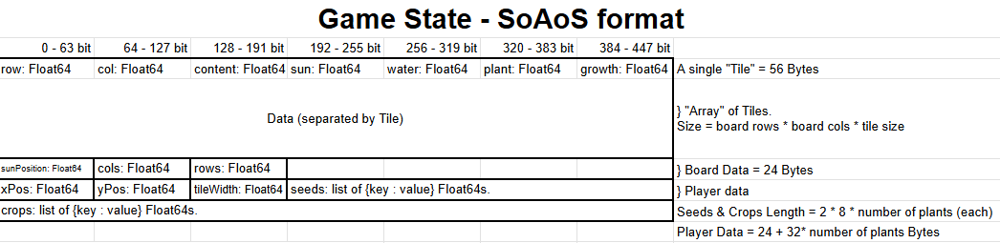

# cmpm-121-final

The final project for fall 2024 cmpm-121.

# Devlog entry - 13 Nov 2024

## Introducing the Team

-    alhinator: Engine lead. Will be heading engine choice, filestructure organization, documentation standards.
-    Ben: Tools lead. I will research and identify development tools for the team then ensure that we have them properly set up.
-    tranhunter84: Design lead. Will be responsible for setting the creative direction of the project, and establishing the look and feel of the game.

## Tools and Materials

-    For our platform, we intend on using default HTML canvas rendering. Our initial idea is to use an ascii-art/command line style, so complex graphic capabilities are not at all necessary.
-    We plan to use Typescript as both our primary and alternative language. This will allow us to maintain strict type checking as well as syntactical structure throughout the change halfway through the project. We'll likely be using JSON to store premade data structures, as well as utilizing it for localstorage reading and writing.
-    We plan to use VS Code as our IDE. This will allow for easy setup and integration of tools.
-    We will use git as our source control system and host our repository on Github. This will allow us to colaborate and manage our changes. We will be using Vite for compiling and packaging.
-    Our Alternate platform is the Phaser.js framework. We will remain in Typescript, but switch to the scene-based Phaser engine for drawing and rendering our game. We chose this alternate engine due to our shared experience and familiarity with the platform, and the fact that we won't need to change any of our logic or data storage code, only our display, input, and scene code.

## Outlook

Team Goal: Our goal as a team is to create a command-line game (accomplished either as a script that runs in the command line or graphical representation of a shell window) that utilizes ASCII-art and styling for sprites & other visual elements.

-    (alhinator) I hope to gain experience in the realm of properly documenting all my code to JSDoc standards. I've had experience with that form of documentation before, but never held myself to the standard of documenting Everything.
-    (Ben) I hope to get more experience designing and developing software in a team setting. This includes contributing code that is well designed and documented, as well as integrating cleanly with code written by others.
-    (tranhunter84) I hope to learn more about team-based development of small-scale projects that get completed on a short timeline, and specifically learn more about maintaining uniform coding standards across code changes from multiple team members.

# F0 Devlog - 22 Nov 2024

## How we satisfied the software requirements

### [F0.a] You control a character moving over a 2D grid.

(Hunter Tran)

-    The player can move about the 2D grid using WASD for movement controls.

(Ben Hess)

-    The grid is drawn each frame via the Board.draw function

### [F0.b] You advance time manually in the turn-based simulation.

(Hunter Tran)

-    A turn system with a turn GUI denoting the game's current turn allows the player to increment the game's turn manually by pressing a button.

### [F0.c] You can reap or sow plants on grid cells only when you are near them.

(alhinator)
The player can affect the tile vertically below them with the following operations:

-    X to sow
-    Z to reap
-    C to switch between seeds

### [F0.d] Grid cells have sun and water levels. The incoming sun and water for each cell is somehow randomly generated each turn. Sun energy cannot be stored in a cell (it is used immediately or lost) while water moisture can be slowly accumulated over several turns.

(alhinator)

-    Sun and water levels are stored in each "Tile" of the "Board", and updated every turn via the Tick() -> UpdateSunTiles() & Irrigate() functions.
-    When asssigning sun values, the sun's position is considered as a column over the board. A tile's sunlight value is based on distance from the sun's columnal position with random variance. If a tile is outside of the sun's "range", it recieves no light that turn.
-    When assigning water values, each tile on the board is tested for a water source. If it is, each tile adjacent to it has its water level increased by a small amount with random variance. Per-tile water level is capped at a certain level, and is consumed once per tick if the tile is occupied by a plant.

(Ben Hess)

-    Water tiles are displayed in blue and dirt tiles become more blue as their water level increases by lerping from dirt color to water color. The brightness all tiles are determined by the max of their sun level and 0.5.

### [F0.e] Each plant on the grid has a distinct type (e.g. one of 3 species) and a growth level (e.g. “level 1”, “level 2”, “level 3”).

(alhinator)

-    Plants can be of the types "Wheat", "Corn", and "Rice". Each strain of plant has a specified number of growth stages, and a visual appearance for that stage indicated by their "displayCharacter" value.

(Ben Hess)

-    All plants are displayed every frame using their current display character in green. The brightness of the plants is also controled by the tile's sun level, similar to dirt and water.

### [F0.f] Simple spatial rules govern plant growth based on sun, water, and nearby plants (growth is unlocked by satisfying conditions).

(alhinator)

-    The formula for plant growth is: `Math.random() < baseGrowthRate * sun * water * rateViaAdjacency `
-    BaseGrowthRate is the strain's innate growth rate as dictated in PlantData.json.
-    sun is the current amount of sun on the tile, similarly, water is the current amount of water on the tile.
-    rateViaAdjacency begins at 1, and increases by a set amount per "friend" plant that is adjacent to a plant. Friends are specific to each strain, and detailed in PlantData.json.
-    The condition to satisfy growth per turn is that a random value between 0 and 1 is less than the calculated growth rate above. A large sun, water, and adjacency rate increase the naturally low base growth rate, and having no sun and no water will not allow a plant to grow.

### [F0.g] A play scenario is completed when some condition is satisfied (e.g. at least X plants at growth level Y or above).

(alhinator)

-    A play scenario is marked as complete by a "you win" text appearing on the screen after the player has harvested at least ten crops of each type.

## Reflection

-    (alhinator) This project has been very easygoing so far for me. It was engaging to actually pay more attention to organizing my code as well as paying attention to SOLID principles, which I am beginning to understand more. Working on the core data structure of the board and its various management functions is a familiar task for me, so I didn't personally need to change my plans or workflow. I can see that we've moved away from our original plan of doing a 'command-line' style game, as it uses WASD and button inputs (this may change in the future?). Additionally, the only ascii stylization remaining is the plants' display characters.

-    (Ben Hess) I've really enjoyed this project so far. I enjoy doing graphics/visual elements of software and that has been my primary task so far. I think our team's coding standards are good and we have all been contributing significantly to the project. I think some reorganization of the way we abstract different components of the project might be necessary in the future, but I think we've generally done a good job at not making changes too difficult.

-    (Hunter Tran) I've enjoyed working on this project so far, it is really satisfying having such great teammates who have helped push their individaul works and seeing it all come together. So far, I feel that the core pieecs of the games are starting to work well, and after this stage of the project, I hope to refine what's been added to the game thus far by changing the visual representations of the core game elements to make sure we stick to our original intent to design an ASCII style game (hopefully).

# F1 Devlog 27 Nov 2024

## How we satisfied the software requirements

### F0[a-e] - Same as last week.

### [F1.a] The important state of your game's grid must be backed by a single contiguous byte array in AoS or SoA format. If your game stores the grid state in multiple format, the byte array format must be the primary format (i.e. other formats are decoded from it as needed).

(alhinator)

-    Our game state is stored in an ArrayBuffer object in SoAoS format. It is considered a single large structure that contains the following structures and array:
-    Board, which is an Array of Tile structures. This section contains the data for each individual tile on the board.
-    BoardData, which contains the generic, non-tile-specific data for the board.
-    PlayerData, which contains the player's position, inventory, and necessary reference variables.

### [F1.b] The player must be able to manually save their progress in the game. This must allow them to load state and continue play another day (i.e. after quitting the game app). The player must be able to manage multiple save files/slots.

(Ben Hess)

-    The game's UI includes buttons for each of the currently saved game slots plus a button to save the game to a new slot.
-    When a button is pressed initially, it loads the game in that slot from local storage. The button for the currently loaded slot will save the current game in that slot.

### [F1.c] The game must implement an implicit auto-save system to support recovery from unexpected quits. (For example, when the game is launched, if an auto-save entry is present, the game might ask the player "do you want to continue where you left off?" The auto-save entry might or might not be visible among the list of manual save entries available for the player to load as part of F1.b.)

(alhinator)

-    Every time the player presses the button to advance time, the game autosaves to a special slot that is overwritten with every autosave. The player may load the most recently autosaved state by clicking the "load autosave" button.

(Ben Hess)

-    The game's UI includes a "Load autosave" which is visible if an auto save exists in local storage. When the button is pressed, the autosave is loaded as the current game state and can be saved.

### [F1.d] The player must be able to undo every major choice (all the way back to the start of play), even from a saved game. They should be able to redo (undo of undo operations) multiple times.

(Ben Hess)

-    Each saved game is encoded as a turn number followed by a list of game states.
-    The "Undo" and "Redo" buttons allow the player to move forward and backwards through this list of game states.
-    When a turn is taken, all future game states are deleted and the new game state is added.

# F2 Devlog 2 Dec 2024

## How we satisfied the software requirements

### F0 - F1:

-    F0[a-e] - Same as last week.

-    [F1.a] - Same as last week.

-    [F1.b] The player must be able to manually save their progress in the game. This must allow them to load state and continue play another day (i.e. after quitting the game app). The player must be able to manage multiple save files/slots.

(Ben Hess)

-    Instead of using JSON to encode the state array for game saves, the project now encodes each byte of the array as a character and saves the resulting string into local storage. This results in significantly less memory being used to store saved games.

-    F1[c-d] - Same as last week.

### External DSL For Scenario Design

(alhinator)

-    In startData.txt, designers are able to express the design for a single scenario. Instructions for creating a scenario as well as the natural language descriptors are included [here](/data/startDataInstructions.md).
-    Designers can specify board size, sun "width", the rate that water tiles hydrate adjacent tiles, and the number of seeds (of each plant type) needed to complete the game. They may also specify the number of starting seeds for each plant, and "condition changes" that last a certain number of turns. The conditions that can be changed are sun width and water rate.

### Internal DSL for Plants and Growth Conditions

(Hunter Tran)

-    In plant.ts an internal DSL for the plants and growth conditions has been defined called PlantDSL, that follows the strucure covered in lecture and in the slides on Internal & External DSLs. The plant definitions are all defined within a singular array-type const variable called "allPlantDefinitions".

### Switch to Alternate Platform

(Ben Hess)

-    The project was ported from using the JavaScript canvas API to using the Phaser engine. This required changes to some parts of our code related to rendering and initialization but everything else was able to remain the same.

## Reflection

(alhinator)

-    Our team's plans have different slightly in the sense that we are now focusing more on achieving requirements than adhering to a specific visual form. Our roles are generally the same, and we've settled into patterns on which responsibilities we tend towards. However, I have seen that all three of us have started slacking with our code documentation.

(Ben Hess)

-    Our team's plans have remained mostly the same since the begining but our roles have definitly become more well defined. I have focused a lot of my efforts on the save/load system since that has required a lot of fundamental changes in how the game works. Those major changes changed the way our project works and the way we think about the structure of the code how it processes the state of the game, but the game was able to remain pretty much the same from a player perspective.

(Hunter Tran)

-    Our team's plans have veered significant from our initial creative goals to design a game fitting a specific visual theme we had in mind, and we have diverted our focus more towards addressing the project spec requirements. Recently I have put a lot of my focus into restructuring the code in necessary refactors in order to implement the internal DSL requirements for the plant and growth data within the game, but I recognize that I need to be a lot more disciplined with more frequent code documentation and descriptive code comments.

# F3 Devlog 6 Dec 2024

## How we satisfied the software requirements

### F0 - F2

-    These requirements were satisfied in the same way as last week.
-    Plants now have different sprites for when they are grown/not grown.

### Internationalization

(Ben Hess)

-   Our game now supports multiple languages by mapping a set of key strings to UI strings for each language. The language objects also store the language's full name (for use in the UI), and weather or not the language is right-to-left.
-   The game's UI now includes a drop down menu which allows the user to select a language. When a language is selected, it is stored in local storage and the game's UI is re-created in the new language.

### Localization

(Ben Hess)

- Our game supports three different languages: English, Arabic (written right-to-left), and Simplified Chinese (iconographic)

### Mobile Installation

(alhinator)

-    Our game is available as a progressive web app for download via the browser on both desktop and mobile platforms.
-    To accomplish this, we simply used the Vite-plugin-PWA plugin, which allowed us to generate a manifest file in our distributed build.
-    Nothing major needed to be changed, and all we had to do was follow the Vite-plugin-PWA documentation.

### Mobile Play (Offline)

(alhinator)

-    To allow our game to play nicer on mobile, we had to add in movement buttons similar to the buttons for D3.

## Reflection

Looking back on how you achieved the new F3 requirements, how has your team’s plan changed? Did you reconsider any of the choices you previously described for Tools and Materials or your Roles? Has your game design evolved now that you've started to think about giving the player more feedback? It would be very suspicious if you didn’t need to change anything. There’s learning value in you documenting how your team’s thinking has changed over time.

(alhinator)

-    We did have to add some new tools. On my end, I added in the Vite plugin for formatting our game as a PWA. Our game design has evolved slightly, but if anything, the feedback specifically for plant growth has regressed, since we switched from 'plants have varying stages of growth' to 'plants are grown or not grown'. We've also added a lot of buttons without too much mind for how they look or where they end up.

(Ben Hess)

-   Our code required some significant changes in order to meet the F3 requirements. The main feature I worked on was internationalization and localization, which required that all UI strings be changed to keys and the entire UI be able to refresh. While the recent changes have allowed us to meet the project requirments, they have also changed the structure of our code in unanticipated ways which has led to some inconsistency and disorganization.